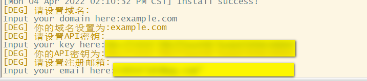

<br>

# V2RAY Web     

  

V2RAY Panel supporting multi-protocol and multi-user

## Description And Function

- System status monitoring
- Supports multi-user and multi-protocol, web page visual operation
- Supported protocols:vmess、vless、trojan、shadowsocks、dokodemo-door、socks、http
- Support configuring more transmission configurations
- Traffic statistics, traffic limit, limit expiration time
- Customizable xray configuration templates
- Support https access panel (bring your own domain name + SSL certificate)
- Supports one-click SSL certificate application and automatic renewal
- For more advanced configuration items, see the panel for details

## Required Items

- VPS Hosting 
- Download and Install Putty: [PuTTY](https://www.putty.org/) for Connect to a VPS
- Domain name for SSL
- Manage DNS records
- Install Apps V2RAY for the device

## Installation Requirements
- OS: Ubuntu Server or Centos
- Version os: 20.xx or last
- RAM: 2 GiB or more
- Space: 25 GiB (In general)
- CPU: 64bit Dual Core CPU 
- Internet Speed: 250 Mbps (min)
- Number of users based on minimum internet speed: 15-20 for 250 Mbps
- Maximum allowed connection based on internet speed: 50 for 1 GiB
- DNS os: Geographical area

## How to Connect to a VPS 
- After launching Putty or opening your shell terminal, the program will require VPS login credentials:

    IP Address / Host: [Supplied in your "New Server Information" email, and also available in Manage Products/Services.]
    User Name: root
    Password: [Supplied in your "New Server Information" email.]
    SSH Port: 22

## Installation
```
1.apt-get check
2.apt-get update
3.apt-get upgrade
```
Finsh Upgrade and:
```
4.reboot
```
Install:
```
5.apt install curl socat
```
```
6.bash <(curl -Ls https://raw.githubusercontent.com/mostafaprohub/x-ui/master/install.sh)
```

- DNS os: Edite Geographical area
```
nano /etc/resolv.conf
```
- DNS check: [DNS leakage](https://dnsleaktest.com)

## Manual Installation

1. First download the latest compressed package from https://github.com/vaxilu/x-ui/releases, generally choose the `amd64` architecture (orginal)
2. Then upload the compressed package to the `/root/` directory of the server, and log in to the server using the `root` user

> If your server CPU architecture is not `amd64`, replace `amd64` in the command with another architecture

```
cd /root/
rm x-ui/ /usr/local/x-ui/ /usr/bin/x-ui -rf
tar zxvf x-ui-linux-amd64.tar.gz
chmod +x x-ui/x-ui x-ui/bin/xray-linux-* x-ui/x-ui.sh
cp x-ui/x-ui.sh /usr/bin/x-ui
cp -f x-ui/x-ui.service /etc/systemd/system/
mv x-ui/ /usr/local/
systemctl daemon-reload
systemctl enable x-ui
systemctl restart x-ui
```

## Cloudflare CDN

Add a site:
[cloudflare ](https://developers.cloudflare.com/fundamentals/setup/manage-domains/add-site/)

Manage DNS records:
[Create DNS records](https://developers.cloudflare.com/dns/manage-dns-records/how-to/create-dns-records/)

## SSL certificate application

> This function and tutorial are provided by [FranzKafkaYu](https://github.com/FranzKafkaYu)

The script has a built-in SSL certificate application function. To use this script to apply for a certificate, the following conditions must be met:

- Know your Cloudflare registration email
- Know the Cloudflare Global API Key
- The domain name has been resolved to the current server through cloudflare

Create API token:
[cloudflare API](https://developers.cloudflare.com/fundamentals/api/get-started/create-token/)

How to get Cloudflare Global API Key:
    
    

When using it, you only need to enter the `domain name`, `email`, and `API KEY`. The diagram is as follows:
        

Things to note:

- This script uses the DNS API for certificate request
- Let's Encrypt is used as the CA party by default
- The certificate installation directory is the /root/cert directory
- The certificates applied for by this script are all pan-domain certificates.
## Upgrade
```
apt-get update
apt-get upgrade
```
```
bash <(curl -Ls https://raw.githubusercontent.com/mostafaprohub/x-ui/master/install.sh)
```

## FAQ
+ What operating systems can V2RAY be installed on?
 Mac - Windows - Android - Linux - IOS
<br>
+ How fast is this service?
 It depends on things like your internet provider host and distance and more

+ Does the use of V2RAY give any limitations?
In general, no, but you need to know what bandwidth and speed your host uses

+ Who is V2RAY suitable for?
It is suitable for personal use or small companies with few members and generally for those who are tired of internet censorship

+ Is there a limit to user creation?
 You can assign a port for each user. If you have more users, you must make sure that the port is free to assign to them

+ How to limit the use of the service for a user?
In the user creation window, you can specify the date and volume of the Internet

+ Can V2RAY be used commercially?
Definitely not. V2RAY can only support a certain number of users. We do not advise you to do this because it will disrupt the service

+ Does the installation of V2RAY include any special rules?
Not necessarily. This depends on your host because some of them have banned the use of services without authentication

## Updates V2RAY

- Fixed some bugs
- Improved user interface
- Improved update
- English version
- Improved installation process
- 

## Migrating from v2-ui

First install the latest version of x-ui on the server where v2-ui is installed, and then use the following command to migrate. All inbound account data of the local v2-ui will be migrated to x-ui, and the panel settings and username and password will be migrated. Will not migrate`

> After the migration is successful, please `close v2-ui` and `restart x-ui`, otherwise the inbound of v2-ui will cause a `port conflict` with the inbound of x-ui`

```
x-ui v2-ui
```

## Thanks
vaxilu for Making this panel

##  License

 GNU GENERAL PUBLIC LICENSE

---
### Other Developers

> Use of Tg robot This function and tutorial are provided by [FranzKafkaYu](https://github.com/FranzKafkaYu) <br>  </br>

X-UI supports daily traffic notification, panel login reminder and other functions through Tg robot. To use Tg robot, you need to apply by yourself.
For specific application tutorials, please refer to [blog link](https://coderfan.net/how-to-use-telegram-bot-to-alarm-you-when-someone-login-into-your-vps.html)
Instructions for use: Set robot-related parameters in the background of the panel, including

- Tg Robot Token
- Tg robot Chat Id
- Tg robot cycle running time, using crontab syntax  

Reference syntax:
- 30 * * * * * //Notification will be made in the 30s of each point
- @hourly      //hourly notification
- @daily       //Notification every day (at midnight)
- @every 8h    //Notification every 8 hours 

TG notification content:
- Node traffic usage
- Panel login reminder
- Node expiration reminder
- Traffic warning reminder 

More features are planned...

### Install Using Docker

> This docker tutorial and docker image are provided by [Chasing66](https://github.com/Chasing66)

1. Install docker

```shell
curl -fsSL https://get.docker.com | sh
```

2. Install x-ui

```shell
mkdir x-ui && cd x-ui
docker run -itd --network=host \
    -v $PWD/db/:/etc/x-ui/ \
    -v $PWD/cert/:/root/cert/ \
    --name x-ui --restart=unless-stopped \
    enwaiax/x-ui:latest
```

> Build own mirror

```shell
docker build -t x-ui .
```
---

### Stargazers Over Time
vaxilu

[](https://starchart.cc/vaxilu/x-ui)
<br>